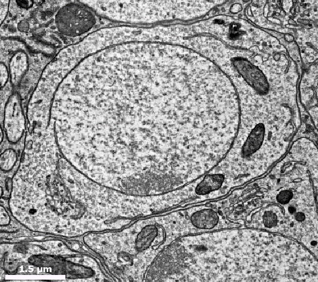

# nuclei_prediction
This code detects all the neuron nuclei & somas from `FANCv4`. Thanks to Jasper, Ran, Brandon, and Stephan, this pipeline identified 17076 putative nuclei after applying a size threshold. We manually inspected each one and found 14679 neurons (86.0%), 1987 glia (11.6%), and 410 false positives (2.4%). The `xyz` locations of all the neuron nuclei are currently available through [CAVEclient](https://cave.fanc-fly.com/annotation/views/aligned_volume/fanc_v4?middle_auth_url=global.daf-apis.com%2Fsticky_auth).

Please contact Sumiya Kuroda for any questions or feedbacks.

## Virtual environment
I recommend to setup 'venv' before running the program.

```sh
# python3 -V 
python3 -m venv nuclei
. nuclei/bin/activate
(nuclei) vscode ➜ ~ $ pip install -r requirements.txt
(nuclei) vscode ➜ ~ $ ipython kernel install --user --name=nuclei # to use .ipynb on venv
```

You can shutdown your `venv` with

```sh
(nuclei) vscode ➜ ~ $ deactivate
```

## Usage
```sh
python3.6 -c "import get_nuc; get_nuc.run_local('task_get_nuc_info')" -c 10 -p 20
./list_missing.sh 13985 block bin
python3.6 -c "import get_nuc; get_nuc.run_local('task_get_nuc_info')" -c 10 -p 20 -i ~/missing.txt
# run until there is no missing block

python3.6 -c "import get_nuc; get_nuc.run_local('task_merge_within_block', count_data=True)" -p 20
python3.6 -c "import get_nuc; get_nuc.run_local('task_merge_across_block', count_data=True)" -p 20
python3.6 -c "import get_nuc; get_nuc.run_local('task_apply_size_threshold')"
```

```sh
python3.6 -c "import nuc2soma; nuc2soma.run_local('task_get_surrounding')" -c 200 -p 20
./list_missing.sh 17075 nuc bin
python3.6 -c "import nuc2soma; nuc2soma.run_local('task_get_surrounding')" -c 200 -p 20 -i ~/missing.txt
# run until there is no missing block

python3.6 -c "import nuc2soma; nuc2soma.run_local('task_save')" -p 20
```

You can run these on different `screen` with `LocalTaskQueue`. Change `--choose` (numbers of pixels you look at) and `--parallel` (number of cpu cores you use) if necessary.

## How it works
We first segmented nuclei from the dataset using a convolutional neural network. Then we got `pt` for each nucleus and soma, eventually allowed us to retrieve `pt_root_id` for all the nuclei and somas. Ran made the convolutional neural network, and Jasper came up with an idea to extract `pt` for somas. Thank you so much!



### 0. Prepare the Data
Make sure you have the access to `FANCv4`. The voxel size of `FANCv4` was `[4.3, 4.3, 45]`nm^3. I mostly used areas around `[7953, 118101, 2584]` to validate my code (which belongs to the block `i = 7817`), but any areas with a lot of nuclei will be useful. For example, the image below displays a different area around `[52268, 84179, 2117]`.


### 1. Nuclei Segmentation
I used the results of Ran's nuclei segmentaion from August 2021. Ran uploaded the intensity map to `auth.get_cv_path('nuclei_map_Aug2021')['url']` and the connected components to `auth.get_cv_path('nuclei_seg_Aug2021')['url']`.


### 2-1. Split into Blocks
I then split the entire volume into separate blocks (or chunks). Each block has a size of [`256, 256, 256`] in `mip4`, which ended up covering `FANCv4` with `13985` blocks in total. This process is included in `task_get_nuc_info()` of `get_nuc.py`, so no need to run separate commands beforehand.


### 2-2. Extract Nucleus pt for each Block
`get_nuc.py` has several function to extract nucleus `pt`. Using the intensity map, `task_get_nuc_info()` extracted `pt` for every connected component in each block. After some tesing, I decided to use an intensity threshold of `0.7`. First, this function randomly looked at a certain numer of voxels inside each connected compoent. And then, this found a single `pt` associated with the most frequent `root_id` for each component. We allowed us to avoid knifemarks.

`task_merge_within_block()` and `task_merge_across_block()` merge any connected compoents with the same `nucleus id` in each block. `nucleus id` is a 17-digit id assigned during Ran's segmentation procedure. `task_apply_size_threshold` applied a size threshold (`[20, 20, 40]` in `mip4`). This size threshold means `width_along_x-axis > 1.4µm`, `width_along_y-axis > 1.4µm`, and `width_along_z-axis > 1.8µm`, leading to the detection of nuclei > ~`3.5`µm^3.

The results were saved in a csv file.


### (2-3). Retrieve pt_root_id of Nuclei
`rootID_lookup.py` can retrieve `pt_root_id` of all nuclei.


### 3-1. Extract Soma pt for each Nucleus
I then extracted soma `pt` with `nuc2soma.py`. `task_get_surrounding()` downloaded a segmentation mask for every nucleus `pt` in the previous csv file. Then, this function shifted the volume of the nuclei by one voxels in every direction. The voxel shift difference should cover some soma `pt` in theory. `pt` with the most frequent `root_id` and most distant from nuclus center became soma `pt`. `task_save` format this results and saved it in a csv file.


### 3-2. Retrieve pt_root_id of Somas
`rootID_lookup.py` can retrieve `pt_root_id` of all somas. Please note that we have already started merging nuclei and their partner somas. 


## Other resources
- Brandon wrote [a very useful instruction](https://github.com/bjm5164/rotation_projects) for how to get used to various tools: `Python`, `Neuroglancer`, `cloud-volume`, etc.

- If you have troubles with the credentials, you can also look at [cloud-volume wiki](https://github.com/seung-lab/cloud-volume). They have very detailed instruction for how to make and save credentials. Also, you may need to create the directory `secret` by running `mkdir -p ~/.cloudvolume/secrets/` before saving your API.