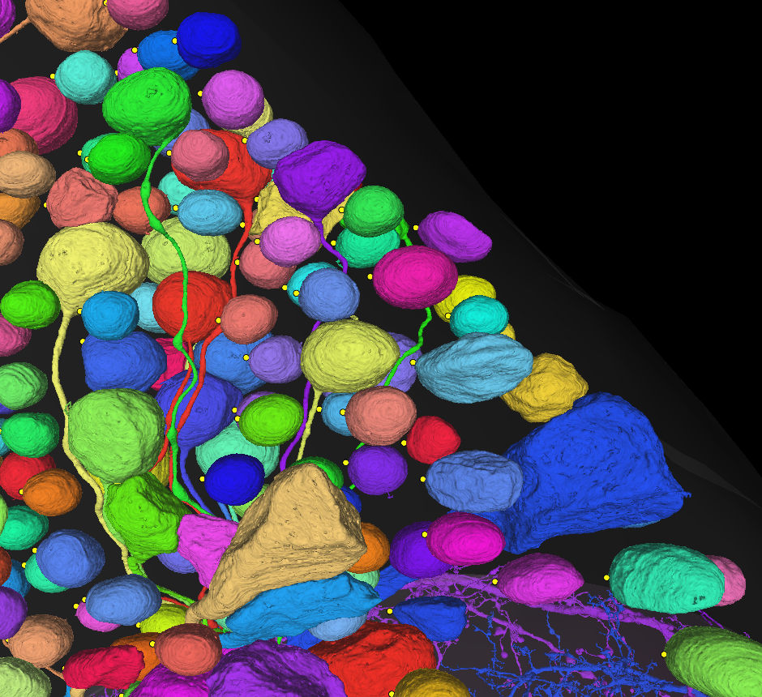

# nuclei_prediction


This code detected all the neuron nuclei & somas in `FANCv4`. Thanks to Jasper, Ran, Brandon, Thomas, Forrest, and Stephan, this pipeline identified 17,076 putative nuclei after applying a size threshold. We manually inspected each one and categorized them to neurons, glias, or false positives (see the table below). There are also some somas that our pipeline could not detect but the FANC community members have found. The numbers in the table are from 2023/01/02, and they are constantly updated when the community members have found wrongly-categorized nuclei (e.g., neuronal nucleus in the glia nucleus table) or missing somas.

| Cell types      |                     | Automatically detected | Manually found |
|:----------------|:--------------------| ----------------------:|---------------:|
| neurons         |                     |                 14,628 |             43 |
| glia            |                     |                  2,019 |              0 |
| false positives | non-neuronal object |                    412 |              0 |
|                 | duplicated neurons  |                     15 |              0 |
|                 | duplicated glias    |                      2 |              0 |

Neuronal somas and glial somas are available through CAVE. You can find more detailed information in [our manuscript](https://doi.org/10.1101/2022.12.15.520299). Please contact Sumiya Kuroda @sumiya-kuroda for any questions or feedbacks.

## Detection
We first segmented nuclei from the dataset using a convolutional neural network made by Ran. Basically, we extracted a point for each nucleus and soma, and used that coordinates to retrieve their `pt_root_id`. We ran the scripts inside `detection` folder using the commands below. We used `LocalTaskQueue` for this version of the scripts, but you can use `TaskQueue` instead, which may increase the computation speed. You can also change `--choose` (numbers of pixels you look at) and `--parallel` (number of cpu cores you use) if necessary.

```sh
python3.6 -c "import get_nuc; get_nuc.run_local('task_get_nuc_info')" -c 10 -p 20
./list_missing.sh 13985 block bin
python3.6 -c "import get_nuc; get_nuc.run_local('task_get_nuc_info')" -c 10 -p 20 -i ~/missing.txt
# run until there is no missing block

python3.6 -c "import get_nuc; get_nuc.run_local('task_merge_within_block', count_data=True)" -p 20
python3.6 -c "import get_nuc; get_nuc.run_local('task_merge_across_block', count_data=True)" -p 20
python3.6 -c "import get_nuc; get_nuc.run_local('task_apply_size_threshold')"
```

```sh
python3.6 -c "import nuc2soma; nuc2soma.run_local('task_get_surrounding')" -c 200 -p 20
./list_missing.sh 17075 nuc bin
python3.6 -c "import nuc2soma; nuc2soma.run_local('task_get_surrounding')" -c 200 -p 20 -i ~/missing.txt
# run until there is no missing block

python3.6 -c "import nuc2soma; nuc2soma.run_local('task_save')" -p 20
```


### 0. Prepare the data
Make sure you have access to `FANCv4` dataset. The voxel size of `FANCv4` is `[4.3, 4.3, 45]`nm^3. We mostly used areas around `[7953, 118101, 2584]` to validate my code (which belongs to the block `i = 7817`), but any areas with a lot of nuclei will be useful. For example, the image below displays a different area around `[52268, 84179, 2117]`.

 

[Neuroglancer](https://neuromancer-seung-import.appspot.com/?json_url=https://global.daf-apis.com/nglstate/api/v1/4666330909245440)


### 1. Nuclei segmentation
We used the results of Ran's nuclei segmentaion from August 2021. Ran uploaded the intensity map to `lib.get_cv_path('nuclei_map_Aug2021')['url']` and the connected components to `lib.get_cv_path('nuclei_seg_Aug2021')['url']`.

 

[Neuroglancer](https://neuromancer-seung-import.appspot.com/?json_url=https://global.daf-apis.com/nglstate/api/v1/5232435516145664)

### 2-1. Split into blocks
We then split the entire volume into separate blocks. Each block has a size of [`256, 256, 256`] in `mip4`, which ended up covering `FANCv4` with `13985` blocks in total. This process is included in `task_get_nuc_info()` of `get_nuc.py`, so no need to run separate commands beforehand.

 

[Neuroglancer](https://neuromancer-seung-import.appspot.com/?json_url=https://global.daf-apis.com/nglstate/api/v1/5152111641755648)


### 2-2. Extract nucleus points for each block
`get_nuc.py` has several function to extract nucleus `pt`. Using the intensity map, `task_get_nuc_info()` extracted `pt` for every connected component in each block. After some tesing, I decided to use an intensity threshold of `0.7`. First, this function randomly looked at a certain numer of voxels inside each connected compoent. And then, this function looked for a single `pt` associated with the most frequent `root_id` in each component. This method can avoid knifemarks.

`task_merge_within_block()` and `task_merge_across_block()` merged any connected compoents with the same `nucleus id` in each block. `nucleus id` is a 17-digit id assigned to each nucleus during Ran's segmentation procedure. `task_apply_size_threshold` applied a size threshold (`[20, 20, 40]` in `mip4`), which was `width_along_x-axis > 1.4 µm`, `width_along_y-axis > 1.4 µm`, and `width_along_z-axis > 1.8 µm`, leading to the detection of nuclei > `~3.5 µm^3`.

The results were saved in a csv file.

 

[Neuroglancer](https://neuromancer-seung-import.appspot.com/?json_url=https://global.daf-apis.com/nglstate/api/v1/6638334461870080)


### (2-3). Retrieve pt_root_id of nuclei
`rootID_lookup.py` can retrieve `pt_root_id` of all nuclei, but is not necessary to do this (since `pt_root_id` is constantly updated).

 

[Neuroglancer](https://neuromancer-seung-import.appspot.com/?json_url=https://global.daf-apis.com/nglstate/api/v1/6638334461870080)


### 3-1. Extract Soma pt for each Nucleus
We then extracted soma `pt` with `nuc2soma.py`. Jasper came up with a very smart idea. First, `task_get_surrounding()` downloaded a segmentation mask for every nucleus `pt` in the previous csv file. Then, this function shifted the volume of the nuclei by one voxels in every direction. In theory, the voxel shift difference should cover some soma `pt`. Therefore, we extracted `pt` with the most frequent `root_id` and most distant from nuclus center as soma `pt`. `task_save` saved the results in a csv file with a proper format.

 

[Neuroglancer](https://neuromancer-seung-import.appspot.com/?json_url=https://global.daf-apis.com/nglstate/api/v1/4597640880717824)


### (3-2). Retrieve pt_root_id of Somas
`rootID_lookup.py` can retrieve `pt_root_id` of all somas, but is not necessary to do this.

 

[Neuroglancer](https://neuromancer-seung-import.appspot.com/?json_url=https://global.daf-apis.com/nglstate/api/v1/5362887786758144)


## Conduct quality check on all detected nuclei
`nuc2soma.py` resulted in 17,076 pairs of nuclei and somas stored in the csv file `soma_info_Aug2021ver5.csv`. We were aware that there were more than one false positives in these putative nuclei, so we started to manually inspect each nucleus and cell body, using `quality_check/proofread_nuclei.ipynb` and `quality_check/proofread_soma.ipynb`, respectively. First quality check found 14,679 neurons, 1,987 glia, and 410 false positives out of 17,076 putative nuclei (`proofread_nuclei.ipynb`). Second quality check found 14,639 neurons and 40 glia out of 14,679 quality-checked nuclei (`proofread_soma.ipynb`). While 14,579/14,639 neurons had soma `pt` (`soma_xyz`) inside their cell bodies, 60/14,639 neurons had soma `pt` outside and we had to manually merge their nucleus/soma pairs during quality check.


## Format soma table
`format/merge_nuclei.py` merged 14,579 nucleus/soma pairs during Jan 12-14, 2022. This code is adapted from Forrest's work. 8,051 pairs turned out to have different `root_id`, and 8,049 of them were successfully merged after this operation. Only 2 resulted in errors. This operation also made the CAVE server's materialization task larger than it normally is, and temporarily broke the process. Therefore, people planning to carry out such large-scale merging operations in the future should contact the CAVE team beforehand.

At the same time, since the original `nuc_xyz` column showed random points inside nuclei, we had to retrieve centers of each nucleus. `center_xyz` was the center of a bounding box for each connected component, but there is sometimes a non-nucleus object at `center_xyz` (e.g., knifemarks). Therefore, we ran `format/get_nucleus_center.py` to recalculate center coordinates.


## Upload soma table to CAVE
After formatting the (local) soma table, we uploaded the result to [CAVE (Connectome Annotation Versioning Engine)](https://github.com/seung-lab/CAVEclient) so that everyone in the FANC community could access to this data. Because of the server's expiration setting, the original nucleus predictions were all deleted. We re-ran the code and generated a new segmentation (and confirmed all the putative nuclei were re-detected), but the nucleus ids were not identical anymore. Therefore, we updated nucleus ids before uploading them to CAVE. `upload2cave.ipynb` shows how we uploaded the table to CAVE as `somas_dec2022`, as well as how future users can use CAVE to conducut similar procedures.


## Manual maintenance of soma table on CAVE
Even though we manually checked our somas' quality multiple times, there is a small chance that some nuclei are still wrongly categorized. In fact, we have already found several glias and false positives labeled as neurons in the soma table. (**The soma table on CAVE is always up-to-date.** If you want to know updated numbers for each cell type/object, please take a look at the table above.)

At the same time, our convolutional neural network missed some nuclei. (e.g., A neuronal nucleus that was partically detected but too small to be picked up by our size threshold.) This is mostly because of the knifemarks, and DeepEM could not segment a nucleus correctly if there is a knifemark on it. Therefore, we asked community members to report if they have found any nuclei that were not listed on the soma table. Those manually identified nuclei have their own 17-digit nucleus ids, which starts from `10000000000000001`. If you are a member of `FANC_soma_edit` group on CAVE, you can use the code in `fanc/upload.py` to upload these missing somas to the soma table. `example_notebooks/update_cave_tables.ipynb` demostrates how to upload them. Currently, @sumiya-kuroda and @jasper-tms are the members of `FANC_soma_edit`.

There are also some other rules when it comes to uploading manually detected somas:
- If you want to upload neurons that have somas outside the dataset and locate on the dorsal side, use coordinates on `z = 10` slice.